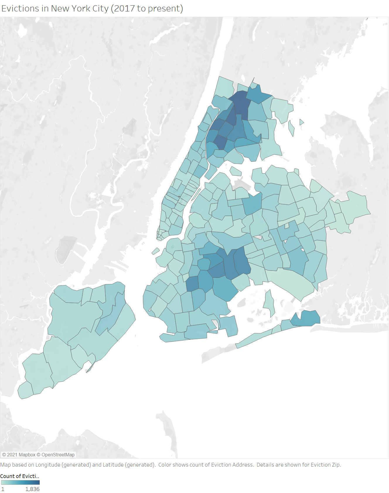

# Evictions in New York City

## About this data

The NYC eviction dataset is provided by the Department of Investigation (DOI). Information is only available  from January 1, 2017.

https://data.cityofnewyork.us/City-Government/Evictions/6z8x-wfk4

Eviction data is compiled from data provided by New York City Marshals. Marshals are independent public officials. 

## Basic Visualization

*Data in the chart was updated on February 24, 2021.*

## Correction

Some mistakes in the dataset were found and manually corrected. 

## Special Note

Because of COVID19, evictions in New York State were temporarily halted. As a result, only a few entities were added since March 2020. There is no data from April 2020 to October 2020.
